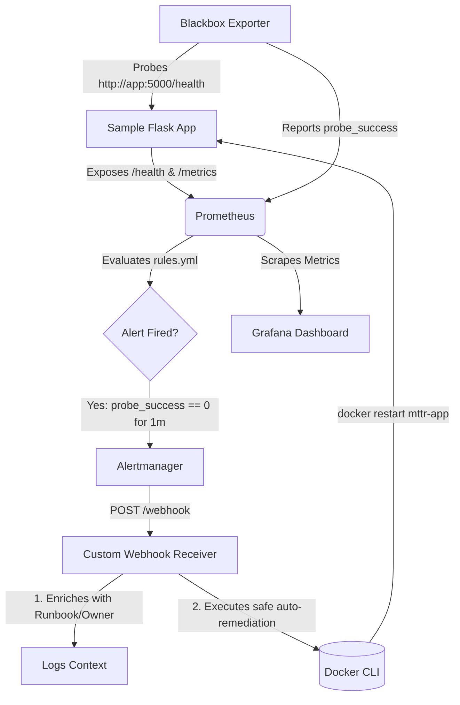

# 🚀 MTTR Observability & Auto-Remediation Stack

A lightweight, production-grade observability and automated incident response pipeline designed to minimize **Mean Time to Detect (MTTD)** and **Mean Time to Resolution (MTTR)**. 

This project is a practical implementation of the technical blueprint *"From Observation to Action: Achieving Faster MTTR with Modern Monitoring Systems"*. It is strictly optimized for resource-constrained environments (e.g., 3GB RAM VMs) while demonstrating enterprise-grade concepts like synthetic monitoring, context-aware alerting, and cautious auto-remediation.

---

## 📖 Blueprint Alignment

This project directly implements the core pillars of modern observability as outlined in the reference blueprint:

1. **Multi-Layered Proactive Intelligence**: Uses **Blackbox Exporter** for user-centric synthetic monitoring (HTTP health checks) rather than relying solely on passive internal metrics.
2. **Context-Aware Alerting**: Alerts are not just raw metrics. The custom webhook receiver enriches alerts with mock runbook URLs and ownership metadata before acting on them.
3. **Cautious Auto-Remediation**: Implements safe, atomic, and reversible recovery actions (container restart) via the native Docker CLI, complete with timeout guardrails to prevent infinite failure loops.
4. **Resource Efficiency**: Designed specifically to run smoothly on a **3GB RAM / 2 vCPU** VMware environment by avoiding heavy stacks (like full ELK or Tempo) in favor of a lean Prometheus + Alertmanager + Grafana core.

---

## 🏗️ Architecture



---

## 🛠️ Tech Stack

- **Metrics & Alerting**: Prometheus, Alertmanager
- **Synthetic Monitoring**: Prometheus Blackbox Exporter
- **Visualization**: Grafana
- **Application**: Python 3.11, Flask, prometheus-client
- **Auto-Remediation Engine**: Python Flask + Native docker.io CLI (via subprocess)
- **Orchestration**: Docker & Docker Compose

---

## 📋 Prerequisites

- A Linux environment (Tested on Debian 13)
- Docker and Docker Compose installed
- Minimum 3GB RAM and 2 CPU Cores (optimized for VMware VMs)
- curl for testing endpoints

---

## 🚀 Quick Start

### 1. Clone the Repository

```bash
git clone https://github.com/zencronautomation/MTTR-Observability-Auto-Remediation.git
cd MTTR-Observability-Auto-Remediation
```

### 2. Start the Stack

Build and run all services in the background:

```bash
docker-compose up -d
```

### 3. Verify Services are Running

```bash
docker-compose ps
```

You should see `mttr-app`, `mttr-prometheus`, `mttr-alertmanager`, `mttr-blackbox`, `mttr-grafana`, and `mttr-webhook` all with Up status.

---

## 🧪 Testing the Auto-Remediation Flow

This is the core demonstration of the project. Follow these steps to watch the system detect a failure and heal itself.

### Step 1: Monitor the Webhook Logs

Open a terminal and tail the webhook receiver logs to watch the auto-remediation logic in real-time:

```bash
docker-compose logs -f mttr-webhook
```

### Step 2: Simulate a Failure

Open a second terminal and trigger the application to fail its health check:

```bash
curl -X POST http://localhost:5000/fail
```

The app will now return HTTP 500 on the `/health` endpoint.

### Step 3: Wait for Detection (~60-90 seconds)

The system is intentionally configured with safety delays:
- Blackbox Exporter probes every 15s
- Prometheus rule requires the failure to persist for 1m before firing (prevents alert flapping)
- Alertmanager groups and routes the alert to the webhook

### Step 4: Observe Auto-Remediation

In the first terminal, you will see logs similar to:

```
[AUTO-REMEDIATION] Alert received: probe_success == 0
[CONTEXT] Runbook: https://wiki.example.com/probe-failure
[CONTEXT] Owner: SRE Team
[ACTION] Restarting container: mttr-app
[SUCCESS] Container mttr-app restarted successfully
```

### Step 5: Verify Recovery

Confirm the application has automatically recovered and is healthy again:

```bash
curl http://localhost:5000/health
```

You should see: `{"status": "healthy"}`

---

## 📂 Project Structure

```
MTTR-Observability-Auto-Remediation/
├── README.md                          # This file
├── docker-compose.yml                 # Orchestration definition
├── app/
│   ├── Dockerfile                     # Flask app container image
│   ├── app.py                         # Sample Flask application
│   └── requirements.txt               # Python dependencies
├── prometheus/
│   ├── prometheus.yml                 # Prometheus configuration
│   └── rules.yml                      # Alert rules
├── alertmanager/
│   └── alertmanager.yml               # Alertmanager configuration
├── blackbox/
│   └── blackbox.yml                   # Blackbox Exporter config
├── webhook/
│   ├── Dockerfile                     # Webhook receiver container
│   └── webhook_receiver.py            # Auto-remediation logic
└── grafana/
    └── provisioning/                  # Grafana dashboards & datasources
```

---

## 🔌 Access URLs

Once running, access the UIs via your VM's IP address or localhost:

| Service | URL | Credentials |
|---------|-----|-------------|
| Grafana | `http://localhost:3000` | admin / admin |
| Prometheus | `http://localhost:9090` | N/A |
| Alertmanager | `http://localhost:9093` | N/A |
| Sample App | `http://localhost:5000` | N/A |

---

## 🔮 Future Enhancements

While this stack is optimized for a 3GB RAM environment, it is designed to be easily extended:

- **OpenTelemetry Collector**: Add distributed tracing and unified log/metric ingestion
- **Loki & Tempo**: Integrate lightweight log aggregation and trace storage for deeper root-cause analysis
- **SLO/Error Budget Alerting**: Evolve from static threshold alerts to SLO-based burn-rate alerting
- **Kubernetes Integration**: Extend auto-remediation for Kubernetes workloads with proper RBAC controls

---

## 📄 License

This project is open-source and available under the MIT License.

---

## ⚠️ Important Note

This project is for educational and demonstrative purposes to showcase modern SRE/DevOps observability patterns. The auto-remediation webhook is configured to restart a specific local container and should be adapted with strict RBAC and guardrails before use in a production Kubernetes environment.

---

**Happy observing and remediating! 🎯**
